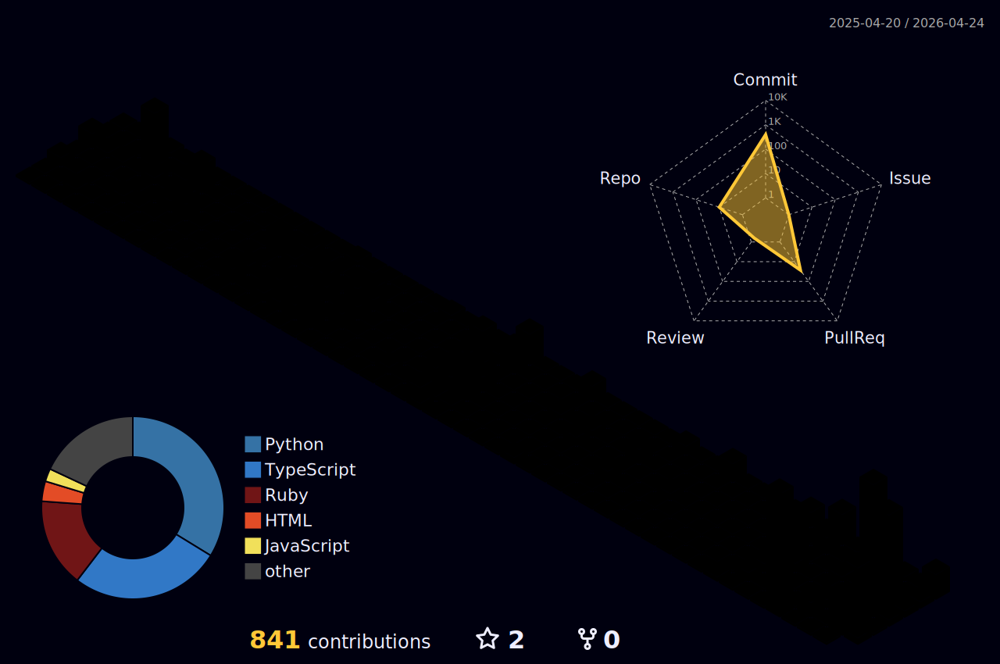

<!-- Profile README for Jason-Latz -->

  

<h1 align="center">Hi, I’m Jason 👋</h1>

  
  

---

## 🌟 About Me

I'm a Northwestern student trying to make new useful things! I also study Psychology, so a lot of the things I am making try to include that interest. I'd love to collaborate if you have any ideas :)
---

## 🧭 My GitHub Metrics

  

---

## 🛠️ Tech Stack

  
  
  
  
  
  

---

## 📬 Contact Me

  <a href="mailto:latz@u.northwestern.edu"><strong>Email</strong></a> •
  <a href="https://www.linkedin.com/in/jason-latz-7b8634242/"><strong>LinkedIn</strong></a>

