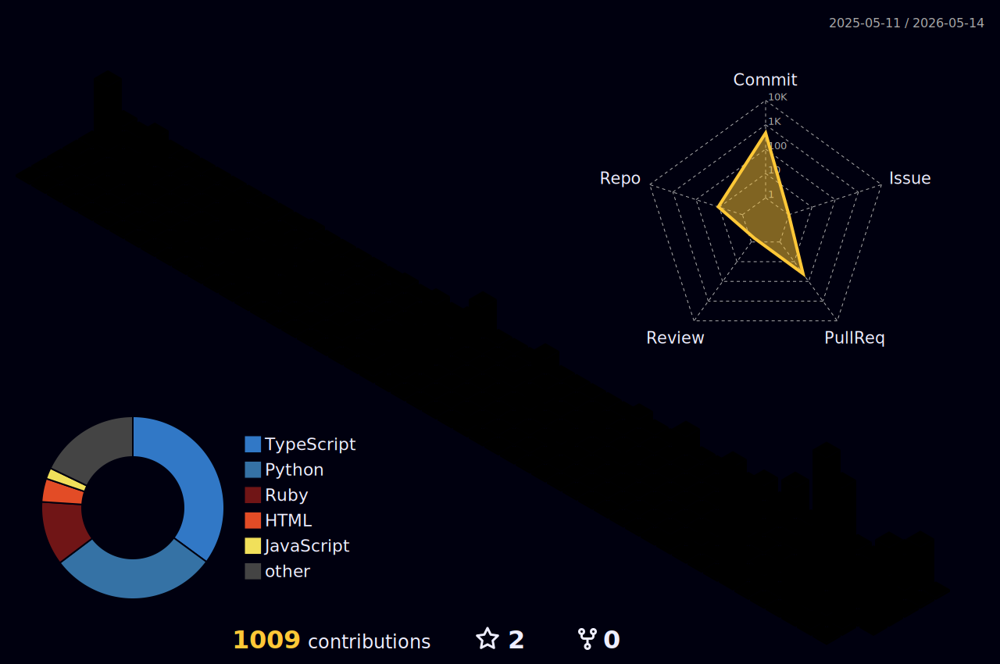

<!-- Profile README for Jason-Latz -->

  

<h1 align="center">Hi, I’m Jason 👋</h1>

  
  

---

## 🌟 About Me

I'm a Northwestern student studying Computer Science and Psychology! Lately, I've been examining new places they can intersect to provide value, especially in education. With new LLM technologies coming out almost daily, there is an incredible opportunity for students to optimize their learning. You can see some of my recent projects down below!

## 💡 Build Queue

- **Seminar Sparring Partner**: turn readings or lecture notes into a live debate partner that argues back, surfaces weak reasoning, and generates follow-up recall prompts.
- **Course-to-Flashcards Pipeline**: ingest slides, notes, and assignment feedback, then produce spaced-repetition cards and a weekly "what to review next" digest.
- **Research Paper Comparator**: upload two or three papers and get a structured map of agreements, conflicts, open questions, and where each paper is actually weak.
- **Study Friction Tracker**: log where learning sessions stall, then use lightweight AI coaching to spot recurring blockers and suggest smaller next actions.
- **Interview Story Builder**: convert project commits, PRs, and notes into concise STAR stories so interesting work becomes easier to explain in recruiting conversations.

---

## 🚀 Recent Work (Updated April 15, 2026)

- On **April 14, 2026**, I pushed a fresh [yapper](https://github.com/Jason-Latz/yapper) iteration that moved live-session orchestration into the shared Swift module, added `swift test` coverage for failed-turn recovery, correction carry-forward, and non-blocking shutdown (`9c0cdfa`, `7385855`), and documented a preference for smaller modular commits (`1ae851d`).
- On **April 14, 2026**, I extended [jbl-site](https://github.com/Jason-Latz/jbl-site) with a cron-protected Spotify history sync route and incremental catch-up logic so weekly artist data stays current on Vercel Hobby, then documented the deployment backstop and sync-cadence rule (`4643268`, `264dc0c`, `5f7a2ab`).
- Opened [Kindle_pdf_translation PR #5](https://github.com/Jason-Latz/Kindle_pdf_translation/pull/5) on **April 15, 2026** to make the stack deploy cleanly on Vercel with S3-backed artifacts and optional Supabase Postgres job state, including a FastAPI serverless entrypoint and relational DB mode support.
- Tightened this [profile repo](https://github.com/Jason-Latz/Jason-Latz) on **April 14, 2026** with workflow token/runtime fixes, recent-activity markers, and a refreshed metrics asset so the weekly automation has cleaner inputs.
- Earlier March focus areas still include [hackscan](https://github.com/Jason-Latz/hackscan), [LessonForge](https://github.com/Jason-Latz/LessonForge), and [gowild-planner](https://github.com/Jason-Latz/gowild-planner), but this week centered on deployment plumbing, sync reliability, and testable session flows.

---

## 📌 Recent GitHub Activity
<!--RECENT_ACTIVITY:start-->
1. ⬆️ Pushed undefined commit(s) to [Jason-Latz/Jason-Latz](https://github.com/Jason-Latz/Jason-Latz) 
2. ⬆️ Pushed undefined commit(s) to [Jason-Latz/Jason-Latz](https://github.com/Jason-Latz/Jason-Latz) 
3. ⬆️ Pushed undefined commit(s) to [Jason-Latz/Jason-Latz](https://github.com/Jason-Latz/Jason-Latz) 
4. ⬆️ Pushed undefined commit(s) to [Jason-Latz/Kindle_pdf_translation](https://github.com/Jason-Latz/Kindle_pdf_translation) 
5. 💪 Opened PR [#5](undefined) in [Jason-Latz/Kindle_pdf_translation](https://github.com/Jason-Latz/Kindle_pdf_translation) 
<!--RECENT_ACTIVITY:end-->

---

## 🧭 My GitHub Metrics

  

---

## 🛠️ Tech Stack

  
  
  
  
  
  

---

## 📬 Contact Me

  <a href="mailto:latz@u.northwestern.edu"><strong>Email</strong></a> •
  <a href="https://www.linkedin.com/in/jason-latz-7b8634242/"><strong>LinkedIn</strong></a>

